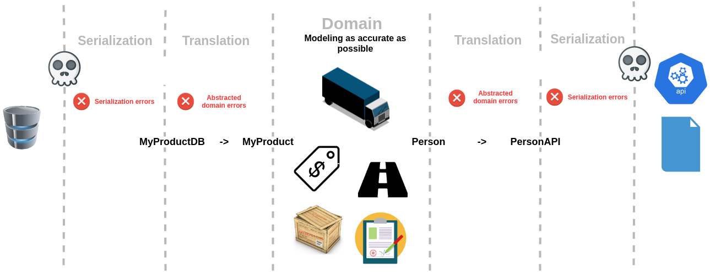
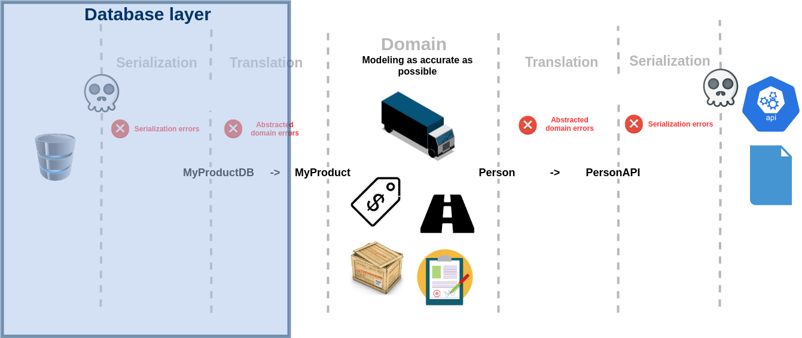

# Marshallable types/objects

As programmer, we have to model our business as accuratly as possible in our software. To do that we use types or objects depending of what our prefered language offers us. But, this task can be hard as long as we have to communicate with the outside world via database, API, etc. It is easy to mix everything up and be chained when a new feature comes..

A solution can be to use intermediate types or objects, sometimes called `data acces object (DAO)` or `data transfert object (DTO)` or published language in Domain driven development world. Let's call the **marshallable types**.

The business layer doesn't have to know how the information is stocked or transfered and must stay as pure as possible.

In this article we will study how those types/objects can help us to be flexible.

## Avoid corrupting your model

It is tempting to use the exact same schema as your database or your transferrable object for your domain modelisation. Sadly this practice makes your code less flexible. We will see how : 

### Price problem example

Prices are not easy to handle. You have this precision problem, and sometimes your need to carry the currency.

Let's say I need to handle the amount and the currency. My database probably looks like this : 

```SQL
CREATE TABLE myProduct (
    id SERIAL PRIMARY KEY,
    name text,
    price_in_cent integer NOT NULL,
    currency text NOT NULL,	
);
```

Hopefully, I have this very useful instance to serialize directly from my type/object to my database. 

I don't have to handle it manually! Pfiou!


```Haskell
data MyProductDB = MyProductDB { id :: UUID
                               , name :: String
                               , priceInCents :: Integer
                               , currency :: String
                               }
                               deriving (ToRow, FromRow)
```

On the other hand, I have a very specific type/object which can handle my price in my domain..

```Haskell
-- safe-money's Dense type

> 2 :: Dense "EUR"
Dense "EUR" 2%1
```

or a more simpler

```Haskell
data Price = Price 
    { amount :: Rational
      currency :: String 
    }
```

What should I do !?

Use the same type/object and forget about modelling my domain as accuratly as possible? .... Nah...

Use the same type/object and forget about my serialization instance and handle it manually? ... It is too much bowler plate! No!

...

Okay then, I can construct an other type/object with my `specific price type` and have conversions functions allowing me to map from a modelisation to another. Bingo!

```Haskell

data MyProduct = MyProduct { id :: UUID
                           , name :: String
                           , price :: Price
                           }

fromMyProductDB :: MyProductDB -> MyProduct
toMyProductDB :: MyProduct -> MyProductDB
```

## Have the liberty to change the representation afterwards

The main advantage to use marshallable types is to have the liberty to change seperatly the different representations without touching the others.

This way, 
- less work
- less risk of breaking something in the process
- you can rely on your tests



Hey! Maybe we should stock money as `Rational` with two `Integer`s into the database! 

### Price problem again ..

No problem! We only have to change the marshallable type `MyProductDB` and change the `conversions functions`. That's it!



## What if my representations are the same in every layers?

Sometimes you don't need .... yet ... different type/object but want to have the liberty afterward when it will evoluate.

### *Haskell's tips*

You can encapsulate your marshallable's type into your model type with a `newtype`.

It is more likely that your domain will change, that is why we prefer to do it this way instead of the other way around. So this way, you will know if you need to break the link between them.

```Haskell

data PersonAPI = PersonAPI { id :: UUID
                           , name :: String
                           , email :: String
                           }
                           deriving (ToJSON, FromJSON)
                     
                     
newtype Person = Person { getPerson :: PersonAPI }

```
## Conclusion

**Marshallable types** 
- are a good way to protect your domain modelisation to anything that could disrupt it.
- allows us to modify only a independ layer if a modelisation change (API, Database, Your Model, etc)
- capitalize on our tests
